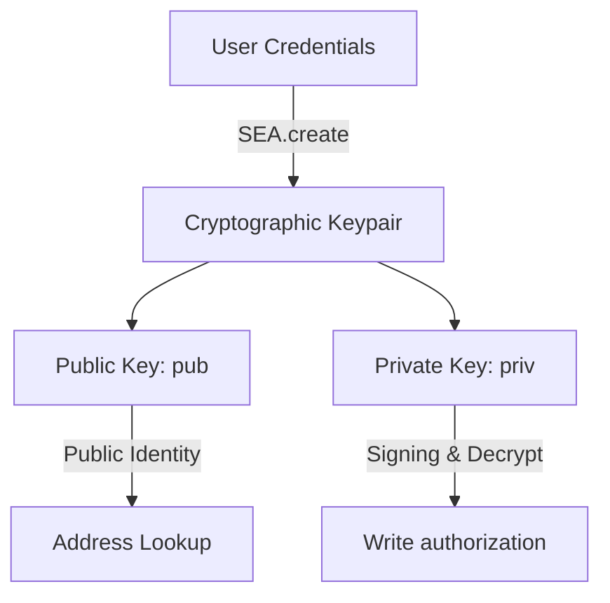

# System Architecture & Technical Specifications

This document outlines the system architecture, cryptographic mechanics, data flows, and database structures utilized in the Salamat Doc P2P Chat application.

---

## 🔒 Cryptographic Model & Credentials

Salamat Doc uses **SEA (Security, Encryption, Authorization)** from Gun.js to secure accounts client-side without relying on central database passwords:



- **Keys Generation**: Accounts are generated as mathematical keypairs directly inside the browser using standard Web Crypto APIs.
- **Verification**: Writing messages to Gun graphs requires signing with the user's private key (`priv`). Other peers verify the message's signature using the public key (`pub`).
- **Keys Modal**: Displayed on account creation. Users copy and store their private keys, which are mandatory for account recovery or cross-device logins.

---

## 💾 Graph Data Schema

### 1. Chat Rooms (`memepi_all_rooms`)
Stores room objects as graph nodes:
```json
{
  "name": "general",
  "creator": "System",
  "creatorPub": "system_pub_key",
  "createdAt": 0,
  "lastActivity": 1721447000000,
  "status": "active"
}
```

### 2. Message Object Structure (`memepi_chat_room_[room_name]`)
Messages inside rooms are appended as nodes in a graph set:
```json
{
  "sender": "docuser1",
  "text": "Hello World!",
  "timestamp": 1721447055000
}
```

---

## 🛡️ Moderation Framework

- **Super Admin**: The creator of the application is identified by their public cryptographic key.
- **Moderators**: Designated users stored under the `memepi_global_moderators` node.
- **Room Inactivity**: Rooms that remain inactive for longer than 24 hours can be removed by moderators, marking them as `status: "inactive"` in the global room registry.
